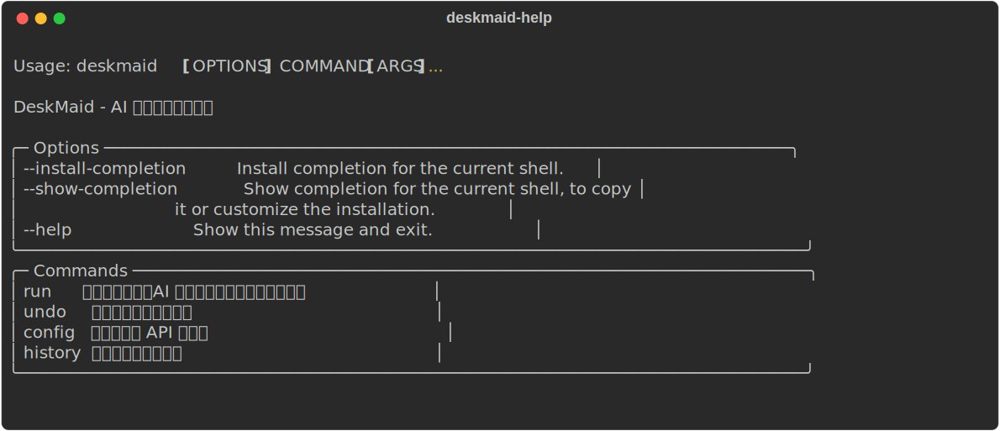
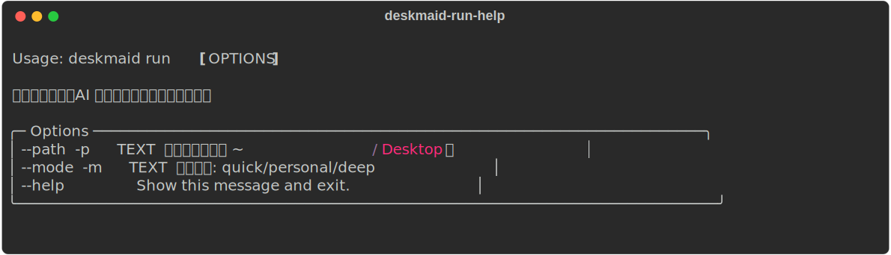
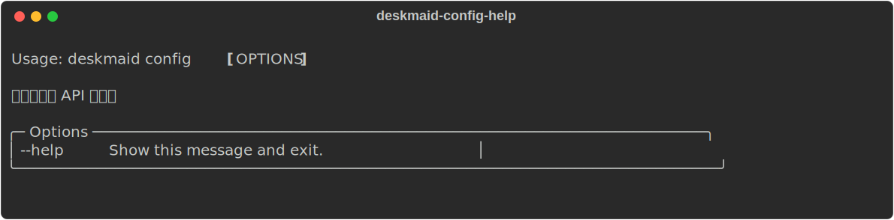
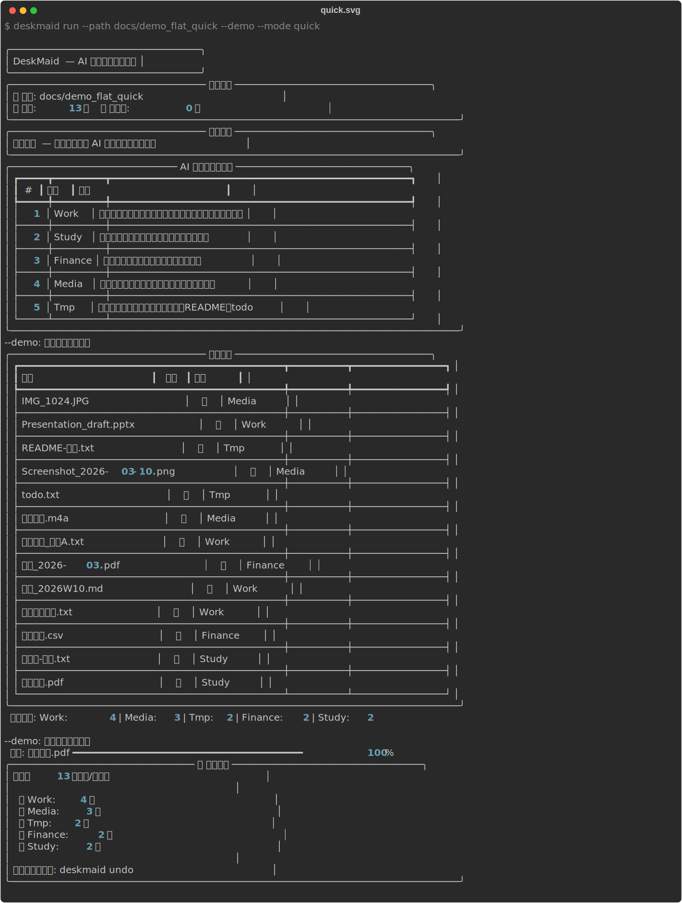
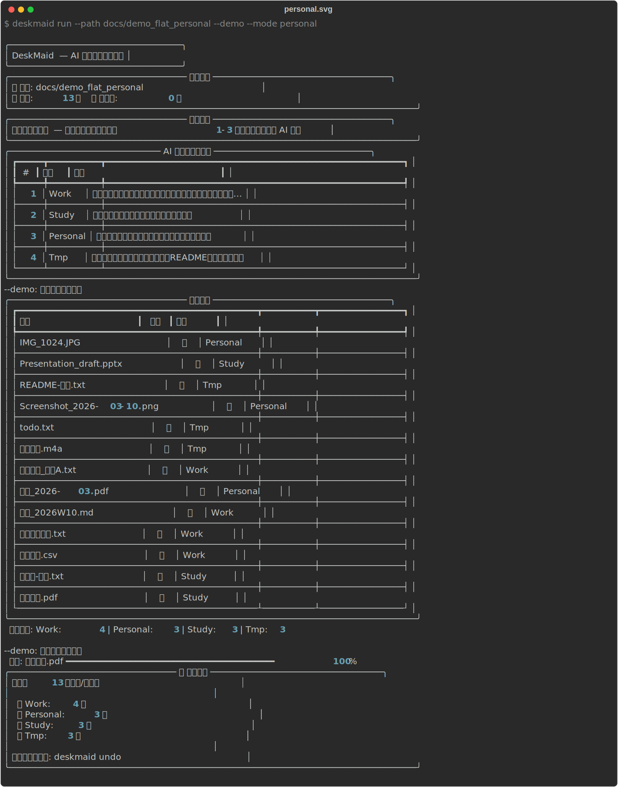
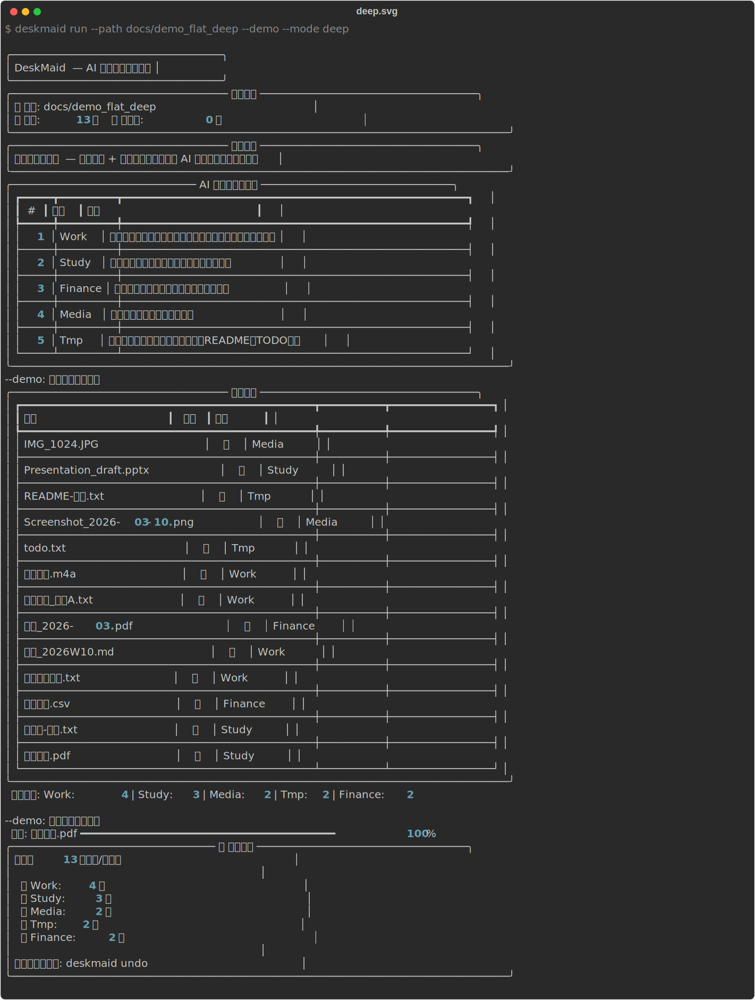

# DeskMaid

AI 智能桌面文件整理工具。扫描桌面文件，利用大语言模型按**真实生活场景**（而非文件格式）自动分类归档。

## 平台支持

- ✅ macOS：当前优先支持（作者主力环境）
- 🕒 Windows：计划中（欢迎合作者一起推进）

## 运行演示（CLI）

> 下面是本项目 CLI 的真实输出截图（SVG，可在 GitHub 上直接清晰缩放）。

### 查看帮助



### 运行（参数说明）



### 配置 API



## 完整演示：三种模式跑一遍（截图）

我准备了一个“杂乱桌面”示例目录（混合了工作/学习/财务/媒体/临时文件），并用 `--demo` 自动确认模式跑通全流程，方便你快速感受效果。

> 说明：`--demo` 只用于演示/录屏，会自动确认交互；真实使用时不建议开。

### Quick（快速分类）



### Personal（个性化快速分类）



### Deep（个性化深度分类）



## 功能特性

- **三种分类模式** — 根据需求选择不同深度的整理方式：
  - **快速分类** (`quick`) — 直接扫描 + AI 分类，快速整理
  - **个性化快速分类** (`personal`) — 采集用户偏好后再分类，结果更贴合个人使用习惯
  - **个性化深度分类** (`deep`) — 在个性化基础上读取文件内容，实现语义级精准分类
- **AI 智能分类** — 根据文件名语义和上下文，按用途场景（工作、学习、生活等）提出分类方案，而非简单按后缀归类
- **用户画像记忆** — 个性化模式下的偏好自动保存，后续运行可直接复用或更新
- **文件内容感知** — 深度模式支持读取文本、Office 文档（docx/xlsx/pptx）和 PDF 内容辅助分类
- **交互式确认** — 分类方案和整理预案均需用户确认后才执行，支持对分类方案提出修改意见并让 AI 重新生成
- **一键撤销** — 每次操作记录完整事务日志，可随时撤销恢复原状
- **多 API 支持** — 支持 Azure OpenAI、OpenAI 及自定义兼容 API

## 安装

```bash
pip install -e .
```

需要 Python >= 3.10。

## 快速开始

### 1. 配置 API

```bash
deskmaid config
```

按提示选择 API 提供商（azure-openai / openai / custom），填入 API Key、Base URL 和模型名称。配置保存在 `~/.deskmaid/config.json`。

### 2. 整理桌面

```bash
deskmaid run
```

流程：
1. 扫描桌面所有文件和文件夹（自动跳过隐藏文件和 Office 临时文件）
2. 选择分类模式（快速 / 个性化 / 深度）
3. AI 分析文件并提出分类方案 → 用户确认或提出修改意见
4. AI 将每个文件/文件夹分配到对应分类 → 展示整理预案
5. 用户确认后执行移动操作

可通过 `--path` / `-p` 指定目标路径，通过 `--mode` / `-m` 指定分类模式：

```bash
deskmaid run --path ~/Downloads
deskmaid run --mode quick          # 快速分类
deskmaid run --mode personal       # 个性化快速分类
deskmaid run --mode deep           # 个性化深度分类
```

### 3. 撤销操作

```bash
deskmaid undo
```

### 4. 查看历史

```bash
deskmaid history
```

## 项目结构

```
deskmaid/
├── cli.py              # CLI 入口，基于 Typer + Rich
├── modes.py            # 分类模式定义与选择 UI
├── interview.py        # 用户访谈引擎，偏好采集与持久化
├── content_reader.py   # 文件内容提取（文本/Office/PDF）
├── ai_engine.py        # AI 分类引擎（两步：提出方案 → 分配文件）
├── scanner.py          # 桌面文件扫描器
├── organizer.py        # 文件移动执行器，含冲突处理和事务日志
├── config.py           # 配置管理（~/.deskmaid/）
└── undo.py             # 撤销机制
```

## 依赖

- [Typer](https://typer.tiangolo.com/) — CLI 框架
- [Rich](https://rich.readthedocs.io/) — 终端美化输出
- [OpenAI Python SDK](https://github.com/openai/openai-python) — AI API 调用
- [python-docx](https://python-docx.readthedocs.io/) — Word 文档读取
- [openpyxl](https://openpyxl.readthedocs.io/) — Excel 文件读取
- [python-pptx](https://python-pptx.readthedocs.io/) — PowerPoint 文件读取
- [pdfplumber](https://github.com/jsvine/pdfplumber) — PDF 文件读取

## 贡献 / 合作

欢迎任何形式的贡献：Bug 修复、Windows 适配、文档补充、功能建议。

- 你可以直接提 Issue 描述需求/问题
- 或者 Fork 后提 PR

## Star History

[](https://star-history.com/#TreeEast1/DeskMaid&Date)

## 许可证

MIT
